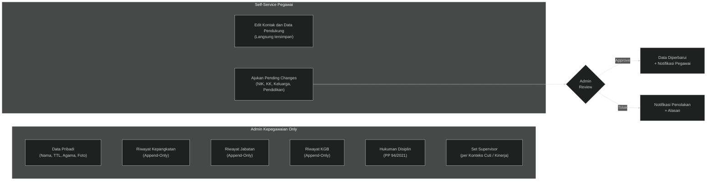
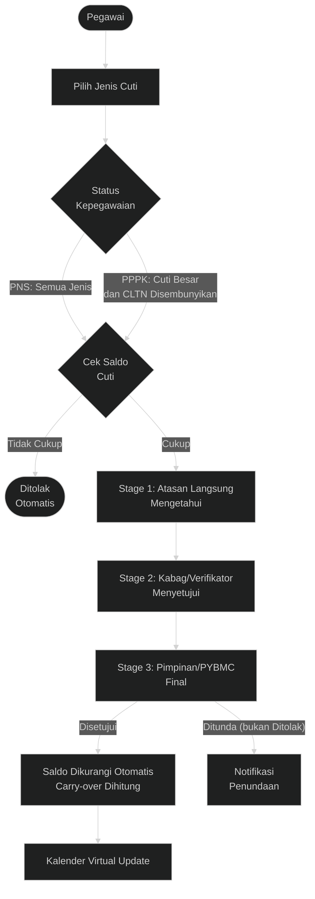
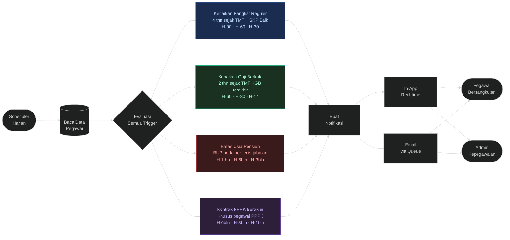
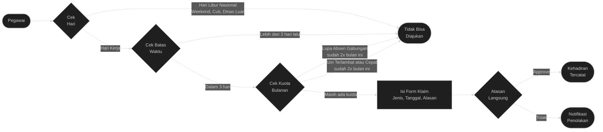
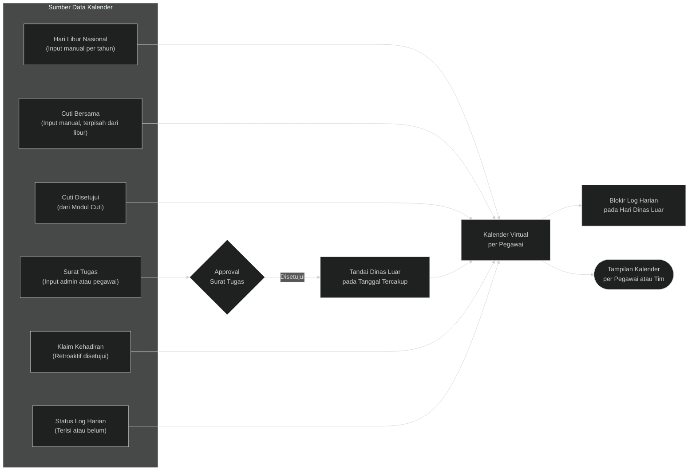
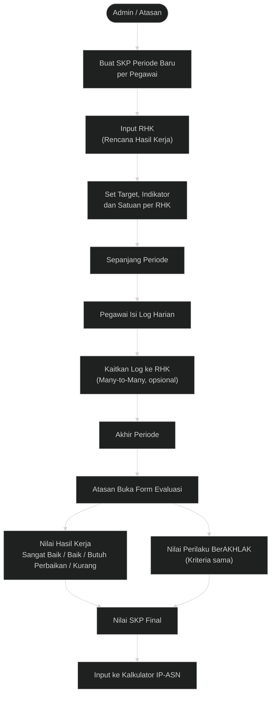
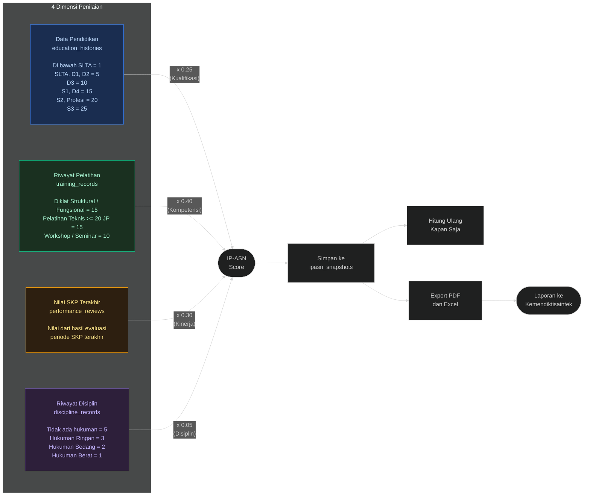
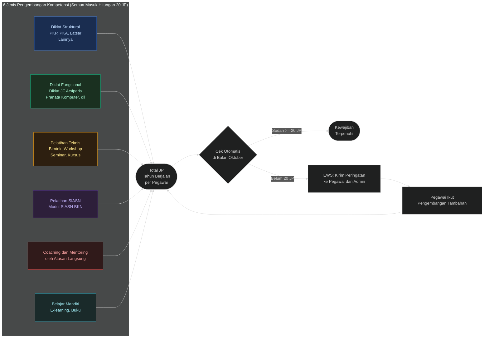
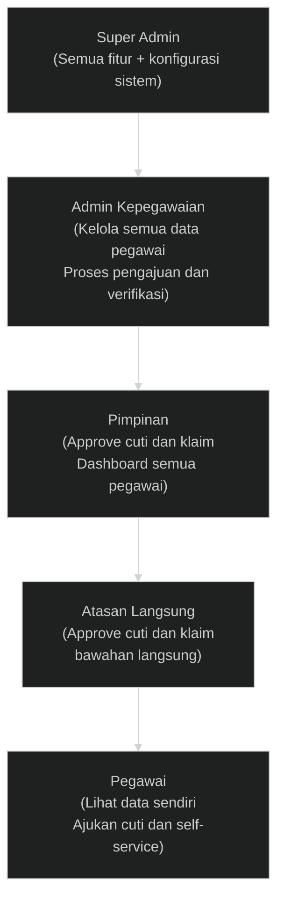
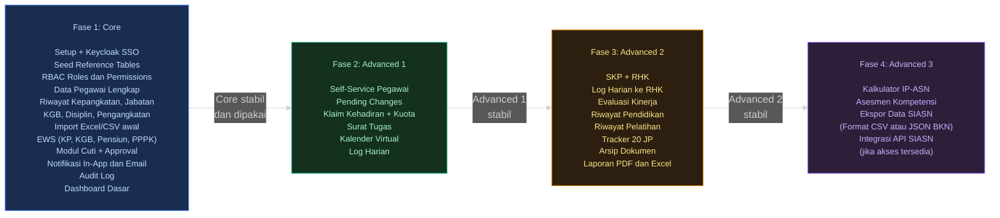

# Ekstraksi Diagram SIMPEG v0.4

Sumber: https://stalwart-tiramisu-848810.netlify.app/

> Catatan sinkronisasi PRD v1.1: dokumen ini adalah referensi legacy dari diagram v0.4. Untuk implementasi, ikuti `PRD-SIMPEG-Fase1-Core.md` v1.1: Keycloak hanya SSO, RBAC internal SIMPEG, domain/server disiapkan saat deployment, approval cuti mendukung skip approver duplikat, dan BUP berbasis referensi jabatan.

Konteks: Sistem Kepegawaian LLDIKTI XVI; ~46 pegawai internal; Laravel 12 + Blade + PostgreSQL 17 + Keycloak SSO; domain final disiapkan saat deployment; v0.4 — Mei 2026.

## 1 · Alur Input Data Pegawai

3 jalur akses: admin-only (append-only) · self-service langsung · pending changes (butuh persetujuan admin)

## 2 · Workflow Pengajuan Cuti

Catatan PRD v1.1: alur cuti memakai approval chain yang dapat dikonfigurasi, dengan dukungan skip jika approver sama. Diagram ini tetap referensi legacy v0.4.

## 3 · Early Warning System (EWS)

PP 99/2000 · PP 11/2017 · PP 49/2018 — berjalan otomatis setiap hari. Urgen: Akub Zainal pensiun 1 Sep 2026

## 4 · Klaim Kehadiran (Advanced)

Pengajuan retroaktif absensi — batas 3 hari setelah kejadian, kuota gabungan 2x/bulan

## 5 · Surat Tugas & Kalender Virtual

Kalender terintegrasi dari semua sumber — otomatis blokir log harian pada hari dinas luar

## 6 · Alur SKP & Penilaian Kinerja

PermenPANRB 6/2022 · PP 30/2019 — berbasis hasil kerja (RHK), bukan daftar aktivitas

## 7 · Kalkulator IP-ASN (Advanced)

PermenPANRB 38/2018 · PerBKN 8/2019 — dihitung otomatis dari data yang sudah ada di sistem

## 8 · Tracker 20 JP Pengembangan Kompetensi

PP 11/2017 Pasal 203–217 · SE Kepala BKN No. 3/2022 — wajib 20 JP per tahun, bukan hak pilihan

## 9 · Hierarki Role SIMPEG

5 role — Keycloak SSO, email di-cache lokal dari Keycloak saat login pertama

## 10 · Roadmap Pengembangan SIMPEG

4 fase — Core harus stabil dan dipakai sebelum Advanced dikerjakan

