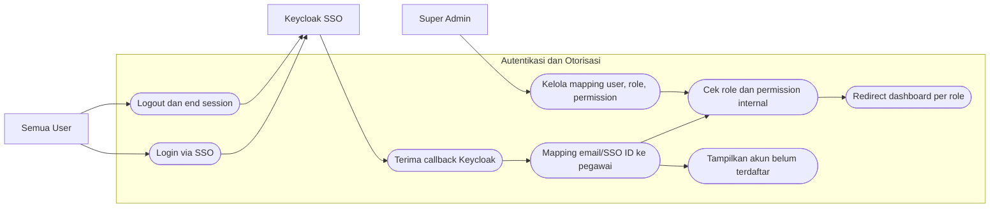
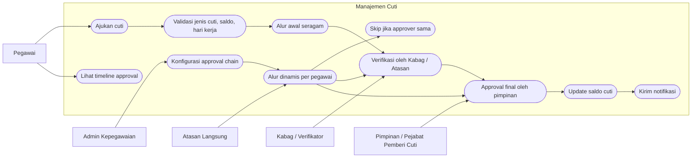
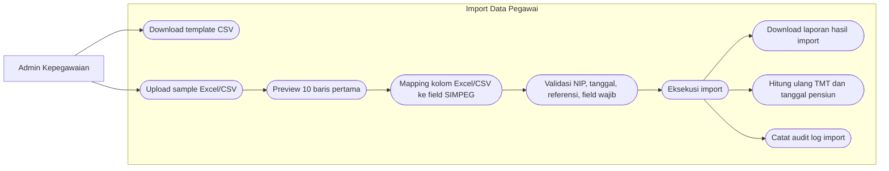
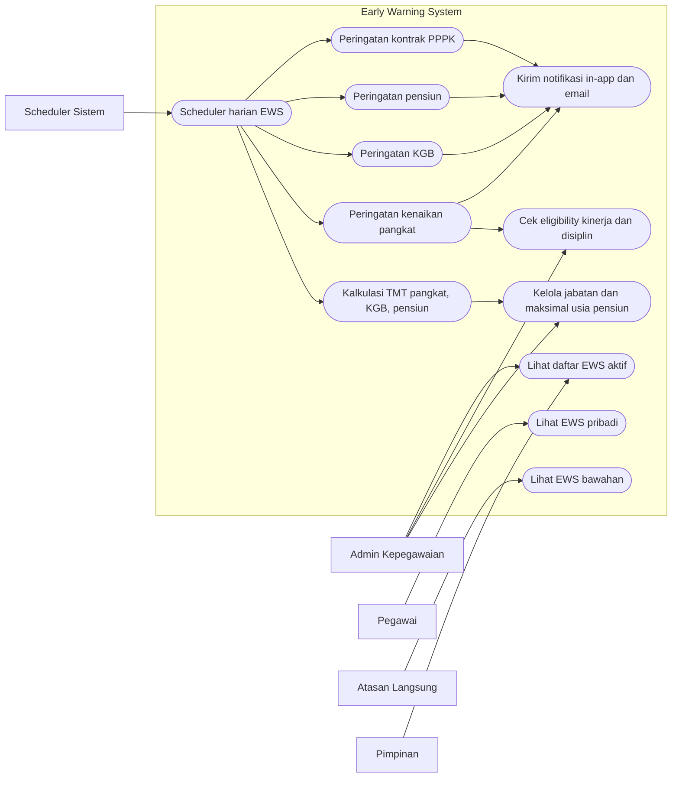

# Use Case Diagram SIMPEG Fase 1

> Sinkron dengan `PRD-SIMPEG-Fase1-Core.md` v1.1. Diagram ini mengikuti keputusan terbaru: Keycloak hanya untuk SSO, RBAC dikelola internal SIMPEG, approval cuti memakai approval chain dengan dukungan skip approver duplikat, development memakai PostgreSQL 17 via container, dan production diarahkan ke Podman.

## Analisis Dokumen

Dokumen yang dianalisis:

| Dokumen | Fungsi Utama | Implikasi ke Use Case |
|---|---|---|
| `PRD-SIMPEG-Fase1-Core.md` | Spesifikasi produk, role, modul, data model, API, NFR | Menjadi sumber utama aktor, modul, batasan Fase 1, dan relasi fitur |
| `User-Stories-SIMPEG-Fase1.md` | Daftar user story per epic | Menjadi sumber utama daftar use case per modul |
| `Issues-SIMPEG-Fase1.md` | Breakdown pekerjaan teknis per sprint | Menjadi validasi scope implementasi dan prioritas teknis |
| `rekap_SIMPEG_LLDikti_Wilayah_XVI.md` | Ringkasan kebutuhan dari paparan awal | Menjadi konteks masalah, manfaat, dan roadmap besar SIMPEG |
| `pertanyaan-yg-masi-perlu-ditanyakan.md` | Daftar pertanyaan klarifikasi | Menjadi sumber isu yang sudah/masih perlu divalidasi |
| `Tim-dan-Pembagian-Tugas-SIMPEG.md` | Komposisi tim dan pembagian sprint | Menjadi konteks urutan delivery dan modul kritis |
| `SIMPEG-v0.4-diagrams.md` | Diagram awal sistem | Menjadi referensi alur awal: input data, cuti, EWS, role, roadmap |

## Penyesuaian Berdasarkan Hasil Meeting

Beberapa keputusan meeting yang perlu masuk ke desain:

1. Login menggunakan Keycloak sebagai SSO.
2. Role dan permission tetap dikelola internal aplikasi, bukan di Keycloak.
3. Tim akan menerima trait/fungsi Keycloak dari pihak LLDIKTI; RBAC dikelola internal di aplikasi SIMPEG.
4. Development menggunakan Laravel 12, Blade, dan PostgreSQL 17.
5. Database development berjalan melalui container.
6. Production diarahkan menggunakan Podman.
7. Approval cuti pada tahap awal dibuat seragam: Pegawai -> Kabag/Verifikator -> Pimpinan.
8. Desain approval tetap disiapkan agar bisa dinamis berdasarkan atasan langsung dan pejabat pemberi cuti.
9. Sample data pegawai disediakan dalam Excel/CSV.
10. BUP tidak dikunci statis; batas usia pensiun menjadi atribut referensi jabatan.

## Aktor Sistem

| Aktor | Peran |
|---|---|
| Pegawai | Melihat profil, mengajukan cuti, melihat saldo cuti, melihat notifikasi dan EWS pribadi |
| Atasan Langsung | Melihat bawahan dan menangani approval tahap awal jika konfigurasi dinamis sudah aktif |
| Kabag / Verifikator | Menjadi verifikator approval cuti pada alur awal |
| Pimpinan | Approval final, melihat dashboard dan laporan |
| Admin Kepegawaian | Mengelola data pegawai, import CSV, cuti, EWS, laporan, dan audit |
| Super Admin | Mengelola konfigurasi sistem, role/permission, reference table, hari libur, dan akses tertinggi |
| Keycloak SSO | Sistem eksternal untuk autentikasi login |
| Scheduler Sistem | Menjalankan EWS harian dan kalkulasi otomatis |
| Email Service / Mailpit | Mengirim atau menguji email notifikasi |

## Use Case Diagram Utama

```mermaid
flowchart LR
    Pegawai["Pegawai"]
    Atasan["Atasan Langsung"]
    Kabag["Kabag / Verifikator"]
    Pimpinan["Pimpinan"]
    Admin["Admin Kepegawaian"]
    SuperAdmin["Super Admin"]
    Keycloak["Keycloak SSO"]
    Scheduler["Scheduler Sistem"]
    EmailService["Email Service / Mailpit"]

    subgraph SIMPEG["SIMPEG Fase 1"]
        subgraph AUTH["Autentikasi dan RBAC"]
            UC_Login(["Login via Keycloak SSO"])
            UC_Logout(["Logout SSO"])
            UC_Session(["Session timeout"])
            UC_MapUser(["Mapping akun SSO ke pegawai"])
            UC_RolePermission(["Kelola role dan permission internal"])
            UC_Redirect(["Redirect dashboard berdasarkan role"])
        end

        subgraph PEGAWAI["Manajemen Data Pegawai"]
            UC_ListPegawai(["Lihat daftar pegawai"])
            UC_CreatePegawai(["Tambah data pegawai"])
            UC_EditPegawai(["Edit data pegawai"])
            UC_DetailPegawai(["Lihat detail pegawai"])
            UC_Profile(["Lihat profil sendiri"])
            UC_History(["Kelola riwayat pangkat, jabatan, KGB"])
            UC_Discipline(["Kelola hukuman disiplin"])
            UC_Family(["Kelola data keluarga"])
            UC_SoftDelete(["Nonaktifkan / restore pegawai"])
            UC_HardDelete(["Hapus permanen pegawai"])
            UC_AssignSupervisor(["Assign atasan langsung"])
        end

        subgraph IMPORT["Import Data Excel/CSV"]
            UC_TemplateCSV(["Download template CSV"])
            UC_UploadCSV(["Upload Excel/CSV"])
            UC_PreviewCSV(["Preview dan mapping kolom"])
            UC_ValidateCSV(["Validasi data import"])
            UC_ExecuteImport(["Eksekusi import"])
            UC_ImportReport(["Laporan hasil import"])
        end

        subgraph CUTI["Manajemen Cuti"]
            UC_RequestLeave(["Ajukan cuti"])
            UC_WorkdayCalc(["Hitung hari kerja cuti"])
            UC_LeaveBalance(["Lihat / kelola saldo cuti"])
            UC_MyLeave(["Lihat daftar cuti pribadi"])
            UC_AdminLeave(["Monitor semua pengajuan cuti"])
            UC_ApprovalConfig(["Konfigurasi approval chain"])
            UC_VerifyLeave(["Verifikasi cuti"])
            UC_FinalApprove(["Approval final cuti"])
            UC_DynamicApproval(["Approval dinamis per pegawai"])
            UC_SkipDuplicate(["Skip approver yang sama"])
            UC_LeaveTimeline(["Lihat timeline approval"])
        end

        subgraph EWS["Early Warning System"]
            UC_TmtCalc(["Kalkulasi TMT otomatis"])
            UC_RunEWS(["Jalankan scheduler EWS harian"])
            UC_EWSList(["Lihat daftar EWS aktif"])
            UC_EWSPersonal(["Lihat EWS pribadi"])
            UC_EWSSubordinate(["Lihat EWS bawahan"])
            UC_PerformanceFlag(["Update flag kinerja baik"])
            UC_PositionBUP(["Kelola usia pensiun pada jabatan"])
        end

        subgraph NOTIF["Notifikasi"]
            UC_InAppNotif(["Lihat notifikasi in-app"])
            UC_AllNotif(["Lihat semua notifikasi"])
            UC_MarkRead(["Tandai notifikasi dibaca"])
            UC_EmailNotif(["Terima notifikasi email"])
        end

        subgraph AUDIT["Audit Log"]
            UC_AuditAuto(["Catat audit log otomatis"])
            UC_AuditList(["Lihat daftar audit log"])
            UC_AuditDetail(["Lihat detail perubahan / diff"])
        end

        subgraph DASH["Dashboard"]
            UC_DashboardAdmin(["Dashboard admin / pimpinan"])
            UC_DashboardPegawai(["Dashboard pegawai"])
            UC_DashboardAtasan(["Dashboard atasan"])
        end

        subgraph REPORT["Laporan dan Export"]
            UC_ExportPegawaiExcel(["Export daftar pegawai Excel"])
            UC_ExportPegawaiPDF(["Export daftar pegawai PDF"])
            UC_ExportCutiExcel(["Export rekap cuti Excel"])
            UC_ExportCutiPDF(["Export rekap cuti PDF"])
        end

        subgraph CONFIG["Konfigurasi dan Reference Table"]
            UC_Holiday(["Kelola hari libur dan cuti bersama"])
            UC_Reference(["Kelola reference table"])
            UC_SystemConfig(["Kelola konfigurasi sistem"])
        end
    end

    Pegawai --> UC_Login
    Atasan --> UC_Login
    Kabag --> UC_Login
    Pimpinan --> UC_Login
    Admin --> UC_Login
    SuperAdmin --> UC_Login
    UC_Login -. autentikasi .-> Keycloak
    UC_Logout -. single_logout .-> Keycloak
    UC_Login -. include .-> UC_Redirect

    SuperAdmin --> UC_MapUser
    SuperAdmin --> UC_RolePermission
    SuperAdmin --> UC_SystemConfig
    SuperAdmin --> UC_Holiday
    SuperAdmin --> UC_Reference
    SuperAdmin --> UC_HardDelete
    SuperAdmin --> UC_AuditList
    SuperAdmin --> UC_AuditDetail

    Admin --> UC_ListPegawai
    Admin --> UC_CreatePegawai
    Admin --> UC_EditPegawai
    Admin --> UC_DetailPegawai
    Admin --> UC_History
    Admin --> UC_Discipline
    Admin --> UC_Family
    Admin --> UC_SoftDelete
    Admin --> UC_AssignSupervisor
    Admin --> UC_TemplateCSV
    Admin --> UC_UploadCSV
    Admin --> UC_PreviewCSV
    Admin --> UC_ValidateCSV
    Admin --> UC_ExecuteImport
    Admin --> UC_ImportReport
    Admin --> UC_AdminLeave
    Admin --> UC_LeaveBalance
    Admin --> UC_ApprovalConfig
    Admin --> UC_EWSList
    Admin --> UC_PerformanceFlag
    Admin --> UC_PositionBUP
    Admin --> UC_AuditList
    Admin --> UC_AuditDetail
    Admin --> UC_DashboardAdmin
    Admin --> UC_ExportPegawaiExcel
    Admin --> UC_ExportPegawaiPDF
    Admin --> UC_ExportCutiExcel
    Admin --> UC_ExportCutiPDF

    Pegawai --> UC_Profile
    Pegawai --> UC_RequestLeave
    Pegawai --> UC_MyLeave
    Pegawai --> UC_LeaveBalance
    Pegawai --> UC_LeaveTimeline
    Pegawai --> UC_EWSPersonal
    Pegawai --> UC_InAppNotif
    Pegawai --> UC_AllNotif
    Pegawai --> UC_MarkRead
    Pegawai --> UC_EmailNotif
    Pegawai --> UC_DashboardPegawai

    Atasan --> UC_DashboardAtasan
    Atasan --> UC_VerifyLeave
    Atasan --> UC_DetailPegawai
    Atasan --> UC_EWSSubordinate
    Atasan --> UC_LeaveTimeline

    Kabag --> UC_VerifyLeave
    Kabag --> UC_LeaveTimeline

    Pimpinan --> UC_FinalApprove
    Pimpinan --> UC_DashboardAdmin
    Pimpinan --> UC_EWSList
    Pimpinan --> UC_ListPegawai
    Pimpinan --> UC_DetailPegawai
    Pimpinan --> UC_ExportPegawaiExcel
    Pimpinan --> UC_ExportPegawaiPDF
    Pimpinan --> UC_ExportCutiExcel
    Pimpinan --> UC_ExportCutiPDF

    Scheduler --> UC_RunEWS
    Scheduler --> UC_TmtCalc
    UC_RunEWS -. include .-> UC_EmailNotif
    UC_RunEWS -. include .-> UC_InAppNotif
    UC_EmailNotif -. kirim_email .-> EmailService

    UC_RequestLeave -. include .-> UC_WorkdayCalc
    UC_RequestLeave -. include .-> UC_LeaveBalance
    UC_VerifyLeave -. extend .-> UC_DynamicApproval
    UC_FinalApprove -. extend .-> UC_DynamicApproval
    UC_DynamicApproval -. include .-> UC_SkipDuplicate
    UC_ExecuteImport -. include .-> UC_TmtCalc
    UC_TmtCalc -. include .-> UC_PositionBUP
    UC_CreatePegawai -. include .-> UC_AuditAuto
    UC_EditPegawai -. include .-> UC_AuditAuto
    UC_ExecuteImport -. include .-> UC_AuditAuto
    UC_VerifyLeave -. include .-> UC_AuditAuto
    UC_FinalApprove -. include .-> UC_AuditAuto
    UC_RolePermission -. include .-> UC_AuditAuto

    classDef actor fill:#eef2ff,stroke:#4338ca,color:#111827,stroke-width:1px;
    classDef external fill:#fff7ed,stroke:#ea580c,color:#111827,stroke-width:1px;
    classDef usecase fill:#f8fafc,stroke:#475569,color:#111827,stroke-width:1px;
    classDef module fill:#ffffff,stroke:#cbd5e1,color:#111827,stroke-width:1px;

    class Pegawai,Atasan,Kabag,Pimpinan,Admin,SuperAdmin,Scheduler actor;
    class Keycloak,EmailService external;
    class UC_Login,UC_Logout,UC_Session,UC_MapUser,UC_RolePermission,UC_Redirect,UC_ListPegawai,UC_CreatePegawai,UC_EditPegawai,UC_DetailPegawai,UC_Profile,UC_History,UC_Discipline,UC_Family,UC_SoftDelete,UC_HardDelete,UC_AssignSupervisor,UC_TemplateCSV,UC_UploadCSV,UC_PreviewCSV,UC_ValidateCSV,UC_ExecuteImport,UC_ImportReport,UC_RequestLeave,UC_WorkdayCalc,UC_LeaveBalance,UC_MyLeave,UC_AdminLeave,UC_ApprovalConfig,UC_VerifyLeave,UC_FinalApprove,UC_DynamicApproval,UC_SkipDuplicate,UC_LeaveTimeline,UC_TmtCalc,UC_RunEWS,UC_EWSList,UC_EWSPersonal,UC_EWSSubordinate,UC_PerformanceFlag,UC_PositionBUP,UC_InAppNotif,UC_AllNotif,UC_MarkRead,UC_EmailNotif,UC_AuditAuto,UC_AuditList,UC_AuditDetail,UC_DashboardAdmin,UC_DashboardPegawai,UC_DashboardAtasan,UC_ExportPegawaiExcel,UC_ExportPegawaiPDF,UC_ExportCutiExcel,UC_ExportCutiPDF,UC_Holiday,UC_Reference,UC_SystemConfig usecase;
```

## Detail Use Case per Modul

### 1. Autentikasi dan RBAC

### 2. Approval Cuti

### 3. Import Data Pegawai

### 4. Early Warning System

## Catatan Scope

Fase 1 berfokus pada fondasi SIMPEG:

- Auth SSO dan RBAC internal.
- Data pegawai dan riwayat.
- Import Excel/CSV.
- Cuti dan approval.
- EWS.
- Notifikasi.
- Audit log.
- Dashboard.
- Laporan/export.
- Reference table.

Fitur seperti self-service edit data, klaim kehadiran, surat tugas, kalender virtual, log harian, SKP, tracker 20 JP, IP-ASN, dan integrasi SIASN/BKN tetap dicatat sebagai fase lanjutan, bukan use case utama Fase 1.
